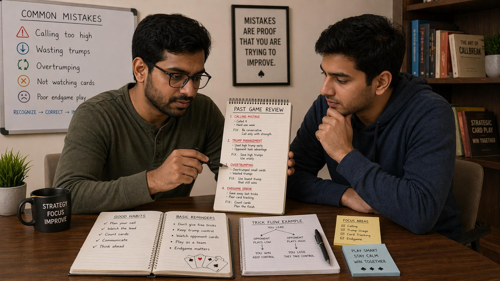

# Callbreak Common Mistakes: What Beginners Do Wrong and How to Fix Them

## 🪶 Introduction

Every Callbreak player, regardless of experience level, makes mistakes. The difference between players who improve quickly and those who plateau is their ability to recognize, analyze, and correct recurring errors. Many Callbreak losses trace back to a handful of predictable mistakes that are easy to fix once you know what to look for.

This guide covers the most common mistakes in Callbreak — from calling errors to trick-taking mechanics — and explains exactly how to address each one. If you want to reduce unforced errors and play more consistently, start here.

---

## 🖼️ Callbreak Common Mistakes Overview

---

## 🎯 Why Mistakes Matter in Callbreak

Callbreak rewards consistency. Unlike games where one lucky play can swing the outcome, Callbreak punishes repeated errors. Even small mistakes compound across 13 tricks per round and multiple rounds per game.

The good news: most Callbreak mistakes fall into a few predictable categories. Once you can identify them in your own play, you can consciously work to eliminate them.

---

# 🧠 1. Overcalling: The Most Common Mistake

New players tend to overestimate the strength of their hands, leading to inflated calls that their team cannot fulfill.

### Why This Happens

When looking at your 13 cards, it is easy to focus on high cards and ignore distribution issues. An Ace looks strong, but if it is accompanied by low cards in other suits, your actual trick-winning potential is limited.

### The Fix

Before calling, systematically evaluate:

- How many tricks can I realistically win if the cards fall average?
- Do I have enough trump cards to cover situations where I cannot follow suit?
- Is my hand balanced across suits or concentrated in one area?

Calling 3 with a weak hand because you hold one Ace is a recipe for losing points. Conservative, accurate calling builds trust with your partner and keeps your score stable.

---

# 🧠 2. Wasting Trump Cards at the Wrong Time

Trump cards are powerful, but they are also finite. Playing them carelessly on low-value tricks often costs you critical tricks later.

### Why This Happens

The excitement of winning a trick leads players to use trump whenever they cannot follow suit, even when the trick being won is not particularly valuable. Over time, this leaves players without trump when they truly need them.

### Example

You have 3 trump cards. Early in the round, you are unable to follow suit and play a trump to win a trick where no opponent had trump. Later, when a critical trick arises and opponents DO have trump, you have nothing left.

### The Fix

Before playing trump, ask yourself:

- Is this trick worth winning at the cost of a trump card?
- Will winning this trick directly contribute to fulfilling my call?
- Do I have enough trump remaining to handle situations later?

If the answer is unclear, it is usually better to discard a low non-trump card and preserve your trump for a more important moment.

---

# 🧠 3. Ignoring What Has Been Played

Callbreak is a game of incomplete information, but the cards already played provide valuable clues. Ignoring them is a significant disadvantage.

### Why This Happens

In the heat of play, it is easy to focus solely on your own hand and the current trick. Players often forget that others have contributed cards to the pile, making it harder to track who holds what.

### The Fix

Develop a habit of briefly acknowledging every card played:

- Which cards have appeared in each suit?
- Has the trump suit been played heavily or minimally?
- Did opponents win tricks early with unexpected card values?

This information helps you infer what cards opponents might hold and adjust your strategy accordingly.

---

# 🧠 4. Not Supporting Your Partner's Call

When your partner makes a high call, your play strategy should shift to support them. Ignoring their call and playing independently is a common team error.

### Why This Happens

Some players become so focused on their own hand that they forget their partner has made a commitment. This leads to misaligned play where both partners pursue separate agendas instead of working toward a shared goal.

### The Fix

When your partner calls high:

- Adjust your play to preserve strength in suits they are likely to lead
- Avoid playing high cards in suits they need unless you are trying to win a specific trick
- Communicate through your cards: playing aggressively or passively signals your intentions

Supporting your partner does not mean sacrificing your own game — it means aligning your decisions with the team's overall strategy.

---

# 🧠 5. Leading with the Wrong Suit

As the first player to lead a trick, you set the agenda. Leading the wrong suit can hand your opponents free tricks or waste your strongest suits prematurely.

### Why This Happens

Many players lead with their longest suit simply because they have many cards in it, without considering whether that suit is actually strong enough to win tricks.

### The Fix

Before leading, assess:

- Do I have high cards in this suit that can actually win tricks?
- Is my partner likely to have strength in this suit?
- Would leading a different suit better set up my partner's strategy?

Leading is not just about playing your cards — it is about creating situations where your team can win tricks efficiently.

---

# 🧠 6. Playing Too Aggressively or Too Passively

Finding the right balance between aggression and caution is one of the harder skills in Callbreak. Many players lean too hard in one direction.

### Over-Aggression

Some players try to win every trick, burning through high cards and trump early. They may win many individual tricks but fail to fulfill their call because they exhausted their resources.

### Over-Passiveness

Other players fold too quickly, playing low cards even when they had a legitimate chance to win. They preserve resources but miss opportunities to score points.

### The Fix

Calibrate your aggression based on:

- Your call: Higher calls require more assertive play
- Your hand strength: Strong hands warrant taking initiative
- Game context: In late rounds, protecting your lead or catching up changes the calculus

Neither extreme is correct in all situations. Good players read the context and adjust accordingly.

---

# 🧠 7. Failing to Adapt to Opponents

Experienced opponents change their play based on what they observe. Failing to adapt makes you predictable and exploitable.

### Why This Happens

Players often develop fixed habits and apply them regardless of what opponents do. This works against weaker players but backfires against skilled ones.

### The Fix

Pay attention to how opponents play and adjust:

- If an opponent consistently avoids certain suits, they may be weak in those suits
- If an opponent plays high early, they may be trying to establish a suit they are strong in
- If an opponent plays unexpectedly low, they may be saving strength for later

Adaptation requires observation. Watch what opponents do and let their patterns inform your decisions.

---

# 🧠 8. Not Reviewing Your Play After the Round

One of the fastest ways to improve is to reflect on your decisions after each round. Players who skip this step repeat the same mistakes indefinitely.

### Why This Happens

After a round ends, there is a natural impulse to move on — either onto the next round or out of the game entirely. Reviewing feels like extra work.

### The Fix

Take 30 seconds after each round to ask:

- Where did I make calls that were too high or too low?
- Which trick did I lose due to a poor decision?
- What would I do differently if I could replay that round?

This habit builds pattern recognition over time and sharpens your decision-making instincts.

---

## ⚠️ General Patterns Behind Most Mistakes

Most Callbreak mistakes trace back to a few root causes:

- **Emotional decision-making**: Playing based on frustration or overconfidence rather than logic
- **Lack of preparation**: Not evaluating your hand honestly before calling
- **Poor communication**: Failing to read and respond to your partner's signals
- **Short-term thinking**: Focusing on winning one trick instead of the full round
- **Failure to track cards**: Not paying attention to what has been played

Addressing these root causes eliminates most individual mistakes simultaneously.

---

## 🧾 Summary

Common Callbreak mistakes are predictable and fixable:

- Evaluate your hand honestly before calling — avoid the trap of overestimating strength
- Conserve trump cards for moments where they genuinely matter
- Track what has been played to make better-informed decisions
- Support your partner's calls by aligning your strategy with the team's goals
- Calibrate aggression based on context, not habit
- Adapt to what opponents reveal through their play
- Review your rounds afterward to identify patterns in your own errors

Callbreak rewards players who think clearly and consistently. Eliminating these common mistakes puts you on that path.

---

## 🔥 SEO Keywords

callbreak common mistakes
callbreak errors beginners make
how to improve callbreak
callbreak strategy mistakes
callbreak calling errors
callbreak trick taking mistakes
callbreak partnership errors

---

## Related Pages

- [Callbreak Fundamentals](./fundamentals.md)
- [Callbreak Decision Making](./decision-making.md)
- [Callbreak Game Awareness](./game-awareness.md)
- [Callbreak Strategic Thinking](./strategic-thinking.md)

## External Reference

For a broader reference, see [related gameplay notes](https://market-lab-cmd.github.io/india-skill-gaming-hub/)
