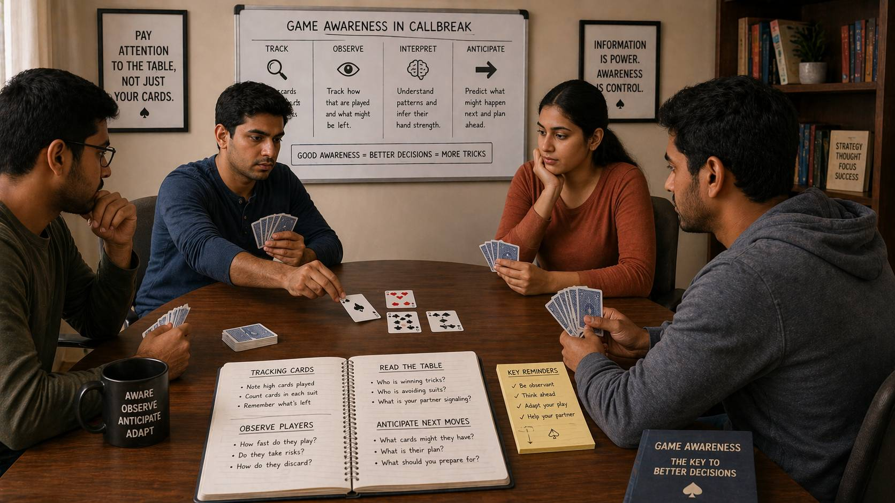

# Game Awareness in Callbreak: How to Read the Table and Anticipate What Comes Next

## 🪶 Introduction

Callbreak is not played in isolation. Every round involves reading the players around you, tracking what has happened, and anticipating what is likely to happen next. Game awareness — the ability to observe systematically, interpret what you see, and adjust your play accordingly — is what separates Callbreak players who improve quickly from those who remain at the same level regardless of experience.

This guide covers how to develop and apply game awareness at the Callbreak table, from tracking cards to reading opponent behavior to understanding table dynamics.

---

## 🖼️ Callbreak Game Awareness Overview

---

## 🎯 What Is Game Awareness?

Game awareness in Callbreak means understanding the full context of the round, not just your own hand. It includes:

- Knowing which cards have been played
- Understanding what your partner likely holds based on their actions
- Recognizing patterns in opponent behavior
- Sensing how the table mood and tempo are shifting
- Anticipating likely outcomes before they happen

Game awareness is not about reading minds. It is about making educated inferences from observable information and using those inferences to make better decisions.

---

# 🧠 1. Card Tracking: The Foundation of Awareness

You cannot make informed decisions without knowing which cards are no longer in play. Card tracking is the foundation on which all other awareness skills rest.

### Basic Card Tracking

Track the following at minimum:

- How many trump cards have been played
- Whether high cards (A, K, Q, J) in each suit have appeared
- Which suits have been led frequently or infrequently
- The approximate number of cards each opponent has played in each suit

### Practical Tracking Methods

Most players cannot memorize every card played. Instead, use a simplified system:

- Keep mental notes on the top 2-3 cards in each suit
- Note when a player wins a trick with an unexpectedly high or low card
- Pay attention to whether players follow suit easily or are forced to trump

Even imperfect tracking is better than no tracking at all. The more you practice, the better your recall will become.

---

# 🧠 2. Reading Your Partner

You cannot speak to your partner during play, but they are constantly communicating through their card choices. Learning to read those signals is essential.

### What Partner Play Tells You

- **Playing high early in a suit**: Suggests they have strength there and may be trying to establish control
- **Playing low consistently**: May indicate they are conserving strength for later
- **Using trump**: They may have a surplus, or they may be protecting against an opponent's strong suit
- **Winning tricks decisively**: Signals confidence in their hand
- **Discarding unexpectedly**: May reveal they are out of a suit or saving something specific

### Reading Context

A single card play can mean different things in different contexts. Always consider:

- Where are we in the round? (Early, middle, or late)
- What does my partner likely need based on their call?
- What have opponents revealed about their holdings?

Interpretation improves with practice and honest reflection after each round.

---

# 🧠 3. Recognizing Opponent Patterns

Opponents, like partners, reveal information through their play. Recognizing patterns helps you anticipate their future actions.

### Common Opponent Patterns to Watch For

**Suit Preferences**

Some opponents consistently lead or win tricks in specific suits. This often reflects their hand composition — they may be long or strong in those suits.

**Betting Behavior**

Opponents who play aggressively early may be trying to establish dominance or clear a suit. Opponents who play passively often have weak hands or are waiting for specific opportunities.

**Tempo Changes**

A player who suddenly changes their play tempo — playing faster or slower than usual — may be reacting to a change in their hand or the round situation.

### When Patterns Deviate

The most important signal is often a deviation from a pattern. If a passive opponent suddenly plays aggressively, or a player who consistently follows suit suddenly fails to do so, something has changed. This usually indicates a significant development in their hand.

---

# 🧠 4. Understanding Table Dynamics

The "feel" of the table shifts throughout a round. Understanding these dynamics helps you calibrate your own play.

### Questions to Ask About the Table

- Is the tempo fast (many tricks decided quickly) or slow (players hesitating)?
- Are opponents playing cooperatively or against each other?
- Is one team controlling the pace, or is the round competitive?
- Are players showing confidence or uncertainty through their play speed?

### Adjusting to Dynamics

Your play should adapt to the table:

- In a fast-paced round, make decisions more quickly but stay disciplined
- In a slow, tactical round, take extra time to analyze before playing
- When opponents are dominant, play more defensively and focus on protecting your call
- When you have control, use it to set up favorable situations for your partner

---

# 🧠 5. Position Awareness

Your position in the turn order affects your options and your information level.

### Acting Early vs. Late

**Early position** (first or second to play):

- Less information about what others hold
- Must commit to decisions with less evidence
- More freedom in choosing which suit to lead

**Late position** (third or fourth to play):

- More information from watching others play first
- Better able to respond to what others reveal
- Easier to follow suit with appropriate cards

### Using Position Strategically

If you act late, you have an information advantage. Use it to:

- Make more accurate decisions about when to win or fold tricks
- Better assess whether your partner needs help
- Decide whether to play aggressively or conserve based on what opponents show

---

# 🧠 6. Momentum and Shift Recognition

Momentum in Callbreak refers to which team is winning the narrative of the round — not just the trick count, but the sense of control and direction.

### Recognizing Momentum

Signs a team has momentum:

- Winning tricks with unexpected strength
- Forcing the other team to play defensively
- Appearing confident and decisive in their play
- Controlling which suits are being played

### Responding to Momentum Shifts

If momentum shifts against you:

- Play more conservatively to protect your score
- Look for a single high-value play to regain control
- Avoid desperate, high-risk plays unless necessary

If momentum is with you:

- Press the advantage without being reckless
- Support your partner's winning strategy
- Do not give opponents easy opportunities to swing momentum back

---

# 🧠 7. Emotional Awareness at the Table

Emotional states affect decision-making. Being aware of your own emotions and reading those of others is part of game awareness.

### Signs of Emotional Play

- Playing unusually fast or slow compared to normal pace
- Taking risks that do not make strategic sense
- Visible frustration or excitement affecting play
- Changes in body language or interaction style

### Managing Your Own Emotions

If you feel frustrated, anxious, or overconfident:

- Take a breath before each play
- Remind yourself of your strategy, not the last mistake
- Focus on the current decision, not the overall score

### Reading Opponent Emotions

Opponents who are emotionally engaged often make less optimal decisions. If you sense an opponent is playing emotionally, maintain your disciplined approach and let their frustration work against them.

---

# 🧠 8. Information Filtering

Not all information you gather is useful. Learning to filter signal from noise is part of developing strong awareness.

### What Matters Most

Prioritize information by importance:

- Trump suit status (how many trumps have been played, who holds them)
- High card locations (which high cards have appeared)
- Partner's likely needs based on their call and play
- Opponent suit weaknesses revealed through play

### What to Ignore or Deprioritize

- Minor variations in play speed that do not correlate with meaningful patterns
- Single data points that contradict a consistent pattern
- Distractions that do not affect gameplay decisions

Overthinking is as dangerous as underthinking. Focus on the most important signals and let the rest go.

---

## ⚠️ Common Game Awareness Mistakes

- **Tracking nothing**: Making decisions without any awareness of what has been played is playing blind
- **Focusing only on your own hand**: Ignoring the table to focus exclusively on personal cards loses critical context
- **Over-reading single events**: A single odd play is often noise, not a pattern
- **Failing to update reads**: Sticking to an initial interpretation even when new information contradicts it
- **Ignoring partner signals**: Your partner is your primary ally — failing to read them costs the team dearly
- **Letting emotion override awareness**: When frustrated or excited, players often ignore information they have gathered

---

## 🧾 Summary

Game awareness gives Callbreak players a significant advantage:

- Track cards systematically to know what has been played and what remains
- Read your partner through their card choices and adjust your play to support them
- Recognize patterns in opponent behavior and anticipate their likely actions
- Understand table dynamics and adjust your tempo and strategy accordingly
- Use your position in the turn order to gather and apply information effectively
- Recognize momentum shifts and respond appropriately to changing round conditions
- Manage your own emotions and stay aware of opponents' emotional states
- Filter information intelligently, focusing on what matters most for each decision

Game awareness is a skill that develops over time with practice. The more attention you pay to these elements, the sharper your reads will become and the better your decisions will be.

---

## 🔥 SEO Keywords

callbreak game awareness
callbreak table reading
how to read opponents callbreak
callbreak card tracking
callbreak partner signals
callbreak strategy awareness

---

## Related Pages

- [Callbreak Fundamentals](./fundamentals.md)
- [Callbreak Decision Making](./decision-making.md)
- [Callbreak Pattern Recognition](./pattern-recognition.md)
- [Callbreak Common Mistakes](./common-mistakes.md)

## External Reference

For a broader reference, see [related gameplay notes](https://market-lab-cmd.github.io/india-skill-gaming-hub/)
